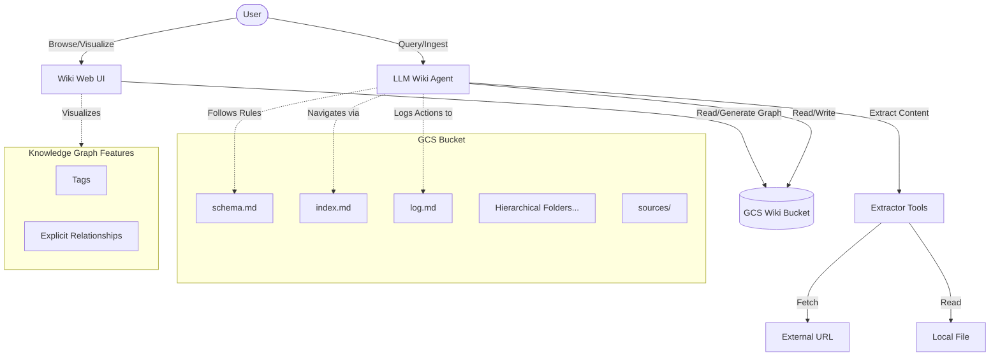

# LLM Wiki Agent

This project implements an ADK-based agent that builds and maintains a persistent knowledge base (wiki) in Google Cloud Storage (GCS), following the "LLM Wiki" pattern. It avoids traditional RAG (Retrieval-Augmented Generation) and vector search, relying instead on the LLM to actively synthesize and organize knowledge into interlinked markdown files, guided by an index. It also features a rich Web UI with an interactive graph view.

## Core Concept

Unlike traditional RAG systems that retrieve raw document chunks at query time and synthesize answers from scratch every time, this agent:
1.  **Incrementally builds** a structured, interlinked collection of markdown files (the Wiki).
2.  **Maintains consistency** and cross-references as new sources are added.
3.  **Uses an index file** (`index.md`) to navigate the wiki, avoiding the need for vector databases.
4.  **Captures Explicit Relationships**: Defines typed connections (e.g., "regulated_by") in page frontmatter.
5.  **Organizes with Tags**: Assigns tags to pages for structured discovery.
6.  **Dynamic Multi-Layer Hierarchy**: Organizes files into logical directories and subdirectories based on domain, growing dynamically as needed.


## Architecture & Design

The system consists of four main layers:
-   **Raw Sources**: Files or URLs provided by the user (immutable).
-   **The Wiki**: A directory of LLM-generated markdown files stored in GCS (configured via `WIKI_BUCKET_NAME` environment variable).
-   **The Schema**: `schema.md` (also in GCS) defining rules and conventions for the agent.
-   **The Web UI**: A Next.js application providing:
    -   **Tree View Sidebar**: Dynamically generated navigation supporting arbitrary depth.
    -   **Interactive Graph View**: Visualizes links, explicit relationships, and tag clusters.
    -   **Perspective Rendering**: Filters graph to show only selected node and its neighbors.


### Agent Design

The agent is built using the Google Agent Development Kit (ADK) and uses the `gemini-3-flash-preview` model. It operates in a ReAct (Reasoning + Acting) loop, using the following tools:


-   **GCS IO Tools**: Read, write, and list files in the GCS wiki bucket.
-   **Extractor Tools**: Extract text content from URLs and files (including PDFs).

### Interaction Flow



---

## The LLM Wiki Pattern vs. Traditional RAG

To fully appreciate the benefits of this active, compounding knowledge base, it is helpful to compare it directly with traditional Retrieval-Augmented Generation (RAG).

| Feature | Traditional RAG | LLM Wiki Pattern |
| :--- | :--- | :--- |
| **State & Memory** | **Stateless**. Retrieves chunks on-the-fly for each query. Forgets what it synthesized last time. | **Stateful**. Actively integrates new information into an evolving, structured knowledge base. |
| **Precision & Links** | **Fuzzy Similarity**. Relies on vector distance, which can retrieve out-of-context or irrelevant text. | **High-Precision Graph**. Uses hard, semantic relationships (`regulated_by`, `related_to`) and tags defined by the LLM in page frontmatter. |
| **Auditability** | **Black Box**. Vector store contains binary embeddings. Extremely difficult for humans to audit or manually correct. | **Transparent**. Made of clean, human-readable Markdown files in GCS. Humans can directly read and edit the agent's memory. |
| **Infrastructure** | **High Complexity**. Requires running a vector database, embedding APIs, chunking algorithms, and tuning parameters. | **Zero Vector Cost**. Relies entirely on standard cloud storage (GCS) and file system structures. No vector database needed. |

---

## Beneficial Use Cases

The LLM Wiki architecture shines in complex, long-form knowledge environments where information is **dynamic**, **highly interlinked**, and **requires human-in-the-loop verification**.

### 📋 1. Insurance Claim Lifecycle & Claims Auditing
*   **The Challenge**: An insurance claims handler faces an influx of 100+ documents per claim—including police reports, medical bills, mechanic estimates, photos, and email exchanges. The claim evolves over weeks or months, and the handler needs to understand the chronological timeline, identify inconsistencies (e.g., medical treatments mismatching the police report), and build a final audit trail.
*   **Why Traditional RAG Fails**: RAG retrieves disconnected fragments of text (e.g., a page from a medical report, a sentence from a policy). It cannot synthesize a cohesive timeline or recognize that a fact retrieved today directly contradicts a fact retrieved two weeks ago because it does not keep state.
*   **The LLM Wiki Solution**: The agent ingests incoming claim documents and actively maintains a compounding claim wiki. 
    *   It builds a structured timeline (e.g., `/claims/CLAIM-123/timeline.md`), updating it chronologically.
    *   It maps explicit relationships, such as tying `/claims/CLAIM-123/injury-report.md` to the `/claims/CLAIM-123/medical-provider.md` via `treated_by`.
    *   The claims handler can review the resulting claims graph in the Web UI, instantly audit the LLM's synthesis, and correct any errors in the markdown files directly, ensuring perfect factual alignment before final payout approval.

### ⚖️ 2. Regulatory & Compliance Intelligence
*   **The Challenge**: Compliance officers in financial services or healthcare must track hundreds of fast-changing regulatory updates, internal policies, and audit reports. They need to map how a new state law impacts existing corporate rules.
*   **The LLM Wiki Solution**: The agent ingests new regulatory circulars and actively updates a corporate policy wiki. It creates tags for compliance areas and links policies directly to regulations (e.g., `policy.md` `-[implemented_for]->` `regulation.md`). This dynamic compliance graph lets officers immediately see the blast radius of any rule change.

### 🔬 3. Codebase & Technical Architecture Mapping
*   **The Challenge**: Developers or research teams trying to map out complex system architectures, codebase structures, or open-source protocols.
*   **The LLM Wiki Solution**: The agent maps out repositories, creates structural directories, extracts and connects concepts (e.g., mapping how MCP servers interact with Agent Platforms), and visualizes these relationships dynamically, creating a self-documenting codebase.

---

## Project Structure

```
agentwiki-adk/
├── app/
│   ├── __init__.py
│   ├── agent.py          # Defines the ADK agent and instructions
│   ├── agent_runtime_app.py # Entry point for Agent Runtime
│   └── tools/
│       ├── __init__.py
│       ├── gcs_io.py     # Tools for reading/writing to GCS
│       └── extractor.py  # Tools for content extraction
├── frontend/             # Next.js Web UI
│   ├── app/              # App router pages and API routes
│   ├── components/       # React components (Graph, Sidebar, etc.)
│   └── ...
├── pyproject.toml        # Dependencies and project metadata
├── schema.md             # Initial schema (uploaded to GCS)
├── index.md              # Initial index (uploaded to GCS)
├── log.md                # Initial log (uploaded to GCS)
├── rag_manifest.json     # Initial manifest (uploaded to GCS)
└── README.md             # This file
```


## Getting Started

### Prerequisites

-   `uv` installed.
-   `agents-cli` installed (`uv tool install google-agents-cli`).
-   Google Cloud SDK installed and configured.

### Environment Configuration

Before running the agent or the Web UI, you must configure the GCS bucket where the wiki will be stored.

For local development, create a `.env` file in the project root **and** in the `frontend/` directory to define the GCS bucket name:

```env
WIKI_BUCKET_NAME=your-unique-gcs-bucket-name
```

*(Note: `.env` files are already configured in `.gitignore` and will not be committed.)*

### Installation

```bash
agents-cli install
```

### Local Development

To test the agent locally using the playground:

```bash
agents-cli playground
```

## Deployment

> [!IMPORTANT]
> Detailed step-by-step instructions for deploying this project to Google Cloud Platform (GCP) with secure **direct Identity-Aware Proxy (IAP) integration** are maintained in [instructions.md](./instructions.md). 
> 
> Please refer to [instructions.md](./instructions.md) for:
> - Required GCP APIs and IAM Role configurations
> - Cloud Run service setup with `--iap` flag
> - GCS Bucket permission binding
> - Multi-stage Docker builds and Artifact Registry push commands
