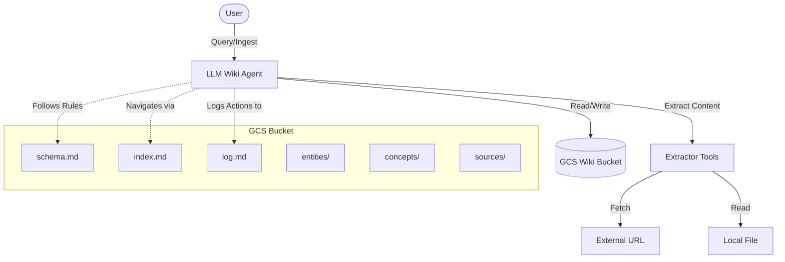

# Beyond RAG: The LLM Wiki Pattern for Compounding Agent Memory

## The Problem with Traditional RAG

Retrieval-Augmented Generation (RAG) has been the go-to pattern for grounding Large Language Models (LLMs) in specific data. While effective, traditional RAG has a fundamental limitation: **it is passive and stateless.**

When a query comes in, the system searches a vector database for relevant chunks, dumps them into the prompt, and the LLM synthesizes an answer from scratch. It doesn't remember what it learned last time. It doesn't connect dots across different queries. It doesn't build a compounding model of the world.

## The Solution: The LLM Wiki Pattern

This project demonstrates a different approach: the **LLM Wiki Pattern**. Instead of relying on a vector database for passive retrieval, the agent actively builds and maintains a structured, interlinked knowledge base (a Wiki) in Google Cloud Storage (GCS).

Key characteristics of this pattern:
1.  **Active Synthesis**: The agent doesn't just retrieve; it reads, summarizes, and integrates new information into existing pages or creates new ones.
2.  **Compounding Memory**: The wiki grows and becomes richer over time. The agent can cross-reference past findings.
3.  **Index-Guided Navigation**: The agent uses a central `index.md` file to navigate the wiki, mimicking how a human might use a catalog or search an encyclopedia, rather than relying on mathematical similarity in a high-dimensional vector space.

## Technical Design

The system is built using the **Google Agent Development Kit (ADK)** and leverages the `gemini-2.5-flash` model for its reasoning and acting capabilities.

### Architecture

The architecture consists of three main layers:
-   **Raw Sources**: Immutable files or URLs provided by the user.
-   **The Wiki**: A directory of LLM-generated markdown files stored in a GCS bucket.
-   **The Schema**: A set of rules and conventions (`schema.md`) that the agent must follow to maintain the wiki's integrity.

### System Interaction Flow

Here is how the components interact:

### Key Workflows

-   **Ingestion**: When new content is provided, the agent extracts the text, creates a summary in the `sources/` directory, identifies key entities and concepts, and updates or creates corresponding pages in `entities/` and `concepts/`. It then updates the `index.md` and logs the action.
-   **Querying**: To answer a question, the agent first consults `index.md` to locate relevant pages, reads them, and synthesizes a response, citing the sources.

## Why This Is a Good Solution

1.  **No Vector Database Complexity**: By avoiding vector databases and embeddings, we eliminate a significant source of complexity, cost, and infrastructure maintenance.
2.  **Human-Readable and Editable**: The entire knowledge base consists of plain markdown files in GCS. Humans can easily read, audit, and even edit the wiki directly if needed.
3.  **High Precision**: LLM-guided navigation via an index can be more precise than semantic search, which sometimes retrieves irrelevant chunks based on superficial word overlap.

## Why This Is So Important

The LLM Wiki pattern represents a step towards more autonomous and capable AI agents.

-   **From Retrieval to Knowledge Management**: It shifts the paradigm from passive retrieval to active knowledge management. The agent is not just a search engine; it is a researcher and a librarian.
-   **Enabling Continuous Learning**: It provides a concrete mechanism for agents to accumulate knowledge over time, overcoming the context window limitations of individual sessions.
-   **Foundation for Complex Reasoning**: A structured, interlinked knowledge base is a much better foundation for complex, multi-step reasoning than a pile of disconnected document chunks.

This project shows that with the right scaffolding and tools, LLMs can be empowered to manage their own knowledge, leading to more intelligent and reliable behavior.
