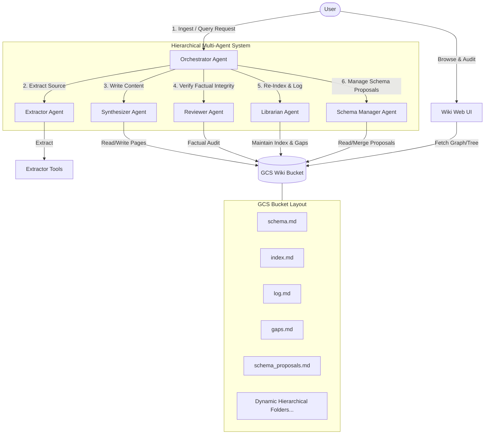
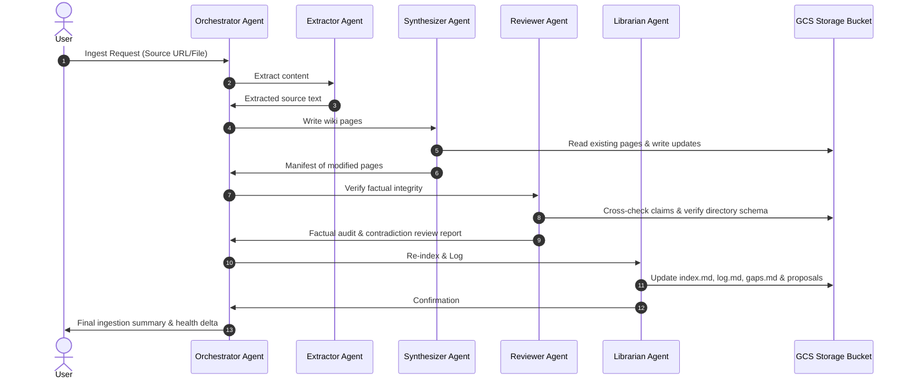
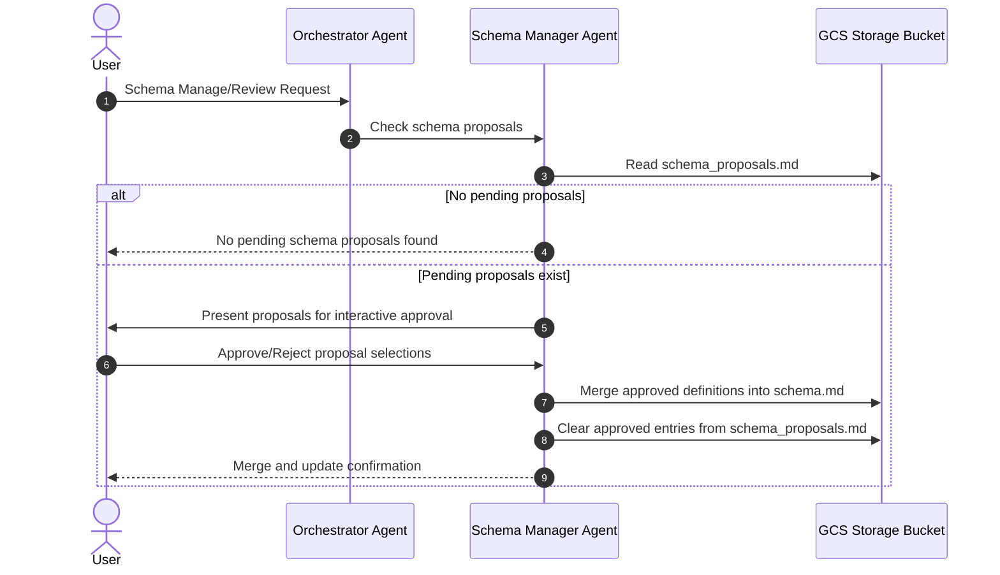
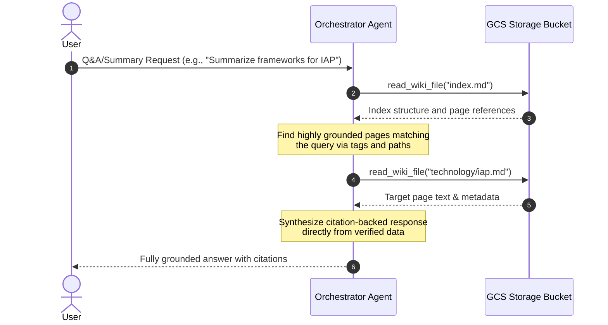
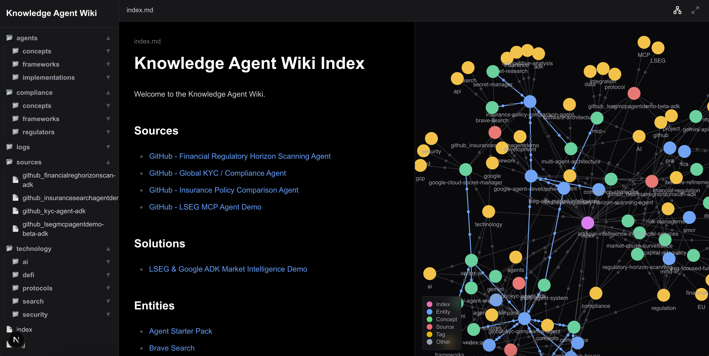

# Beyond RAG: The Active Knowledge Agent Wiki Pattern for Compounding Agent Memory

*Author: Syed Gardezi sgardezi@google.com*
*Date: May 2026*

## The Problem with Traditional RAG

Retrieval-Augmented Generation (RAG) has been the go-to pattern for grounding Large Language Models (LLMs) in specific data. While effective, traditional RAG has a fundamental limitation: **it is passive and stateless.**

When a query comes in, the system searches a vector database for relevant chunks, dumps them into the prompt, and the LLM synthesizes an answer from scratch. It doesn't remember what it learned last time. It doesn't connect dots across different queries. It doesn't build a compounding model of the world.

## The Solution: The Active Knowledge Agent Wiki Pattern

This project demonstrates a different approach: the **Active Knowledge Agent Wiki Pattern**. Instead of relying on a vector database for passive retrieval, the agent actively builds and maintains a structured, interlinked knowledge base (a Wiki) in Google Cloud Storage (GCS).

Key characteristics of this pattern:
1.  **Active Synthesis**: The agent doesn't just retrieve; it reads, summarizes, and integrates new information into existing pages or creates new ones.
2.  **Compounding Memory**: The wiki grows and becomes richer over time. The agent can cross-reference past findings.
3.  **Index-Guided Navigation**: The agent uses a central `index.md` file to navigate the wiki, avoiding the need for vector databases.
4.  **Knowledge Graph Integration**: The agent captures explicit relationships and tags, creating a true knowledge graph.
5.  **Dynamic Hierarchy**: Files are organized into a multi-layered directory structure that grows dynamically based on domain and topic.

## Technical Design

The system is built using the **Google Agent Development Kit (ADK)** and leverages the `gemini-3-flash-preview` model for its reasoning and acting capabilities.

### Hierarchical Multi-Agent Architecture

Rather than a single monolithic agent attempting to execute all steps sequentially, the system leverages a **hierarchical multi-agent orchestration topology** built using the Google Agent Development Kit (ADK). A central, highly structured orchestrator delegates specialized operational tasks to autonomous sub-agents:

- **Orchestrator Agent** ([agent.py](file:///Users/sgardezi/work/projects/agentwiki-adk/app/agent.py)): Coordinates incoming queries, triggers pipeline ingest cycles, delegates specialized subtasks, and compiles final reports.
- **Extractor Agent** ([extractor_agent.py](file:///Users/sgardezi/work/projects/agentwiki-adk/app/agents/extractor_agent.py)): Dedicated solely to source document retrieval, safely extracting un-truncated text content from PDFs, text files, and web URLs.
- **Synthesizer Agent** ([synthesizer_agent.py](file:///Users/sgardezi/work/projects/agentwiki-adk/app/agents/synthesizer_agent.py)): The composition engine that ingests source text, extracts structural entities and tags, and generates or modifies dynamic markdown files in GCS with typed relationships.
- **Reviewer Agent** ([reviewer_agent.py](file:///Users/sgardezi/work/projects/agentwiki-adk/app/agents/reviewer_agent.py)): The quality auditor. It parses newly written files to check for schema compliance, cross-checks claims against the whole wiki for contradictions, and creates stubs for knowledge gaps.
- **Librarian Agent** ([librarian_agent.py](file:///Users/sgardezi/work/projects/agentwiki-adk/app/agents/librarian_agent.py)): The bookkeeper. It updates the navigational index `index.md`, records chronological changes in `log.md`, and notes unresolved stubs in `gaps.md`.
- **Schema Manager Agent** ([schema_manager_agent.py](file:///Users/sgardezi/work/projects/agentwiki-adk/app/agents/schema_manager_agent.py)): **Conditional Execution**. This administrative agent runs only when pending directory schema revisions are logged in `schema_proposals.md`. It presents the suggested extensions and interactively updates the global `schema.md` file.

### Multi-Agent Topology

### Core System Workflows

#### Ingestion Pipeline

When a resource (file, URL, or raw text) is added to the wiki, the Orchestrator executes an automated, multi-stage pipeline:

#### Schema Evolution Pipeline

To accommodate new knowledge domains without manual intervention, the orchestrator runs an interactive schema evolution workflow. The `SchemaManagerAgent` acts conditionally, executing only when there are proposals to process:

#### Retrieval & Q&A Pipeline

When a user queries the wiki for information or a summary (e.g., "Summarize key regulatory frameworks for IAP"), the orchestrator accesses GCS directly to build a citations-grounded summary without vector database overhead:

-   **Ingestion**: When new content is provided, the agent extracts the text, creates a summary in the `sources/` directory, identifies key entities, concepts, and protocols (like MCP), and places them in a logically determined hierarchical directory. It also identifies explicit relationships and tags, updates the `index.md`, and logs the action.
-   **Querying**: To answer a question, the agent consults `index.md` to locate relevant pages, reads them, and synthesizes a response, citing the sources.

## Rich Visualization and Discovery

To make this compounding memory accessible to humans, the project includes a custom Web UI:

1.  **Tree-View Sidebar**: Dynamically generates a navigation tree supporting arbitrary depth, making it easy to explore the dynamic hierarchical folder structure.
2.  **Interactive Force-Directed Graph View**: Visualizes files, concepts, and tags as nodes, and links them via direct references and explicit frontmatter relationships.
    *   **Tag Clustering**: Files cluster around shared tag nodes, instantly revealing common knowledge areas.
    *   **Ontological Line Coloration**: Explicit relationships are colored according to their semantic type (e.g. `regulated_by`, `contradicts`), illustrating the direction of knowledge flow.
3.  **Perspective Rendering**: Clicking any node instantly filters the graph to focus solely on that node and its immediate first-degree neighbors, keeping complex systems clean and readable.
4.  **Ontology State Badges**: Pages display visual status badges indicating whether a page is `ACTIVE` (verified), `STUB` (empty placeholder referencing knowledge gaps), or `CONTESTED` (flagged for factual contradictions).
5.  **Dynamic Confidence circular gauges**: High-fidelity circular progress meters render the Synthesizer's confidence scores directly within the document header.
6.  **Contested Warning Banners**: A prominent warning block is rendered at the top of any contested page, alerting human editors to audit contradictory claims.
7.  **Relationship and References Inspector**: Renders tables of incoming/outgoing typed relationships next to the document text, allowing immediate human navigation.

## The Active Knowledge Agent Wiki Pattern vs. Traditional RAG

To fully appreciate the benefits of this approach, let's compare it directly with traditional Retrieval-Augmented Generation (RAG).

### Traditional RAG: Passive and Stateless

In a standard RAG setup:
1.  **Ingestion**: Documents are chunked, embedded, and stored in a vector database. This is a largely automated, non-semantic process.
2.  **Retrieval**: A user query is embedded, and the system retrieves top-$K$ chunks based on vector similarity.
3.  **Generation**: The LLM reads the chunks and generates an answer.

**Limitations:**
*   **Lack of Synthesis**: The system never synthesizes the chunks into a coherent whole *before* query time.
*   **No Cross-Referencing**: It struggles to connect dots across different documents unless they happen to be retrieved together.
*   **Hallucination Risk**: Vector search can retrieve superficially similar but contextually irrelevant chunks, leading to hallucinated answers.
*   **Temporal Ignorance (Time Blindness)**: Vector search is completely blind to time and versioning. E.g., if an insurance company has multiple versions of policy booklets for its chatbot valid from different points in time, putting all booklets into a standard RAG setup (like VAIS) causes it to retrieve overlapping, linguistically similar chunks from conflicting years simultaneously, even if the user explicitly specifies the policy start date. Standard vector space cannot isolate data by temporal boundaries.

### The Active Knowledge Agent Wiki Pattern: Active and Stateful

The Active Knowledge Agent Wiki pattern flips this model by having the agent actively manage a structured knowledge base.

**Key Benefits Over RAG:**

1.  **Compounding Intelligence (Stateful Memory)**: Instead of answering every query from raw chunks, the agent reads new information and *integrates* it into existing knowledge. The wiki becomes smarter over time, just like a human brain or a well-maintained corporate wiki.
2.  **High-Fidelity Relationships**: By using explicit frontmatter relationships and tags, the system creates a high-precision Knowledge Graph. RAG relies on fuzzy semantic similarity; the Wiki pattern uses hard, semantic links created by the LLM itself.
3.  **Reduced Noise and High Precision**: Guided by a central `index.md` and strict schemas, the agent knows exactly where to find information. It doesn't get confused by similar-sounding but unrelated chunks of text.
4.  **Human Auditable and Editable**: Traditional RAG stores data in a complex, binary vector database that humans cannot read or easily fix. The Active Knowledge Agent Wiki consists of plain markdown files in GCS. A human expert can read them, spot errors, and edit them directly to correct the agent's memory.
5.  **Zero Vector Infrastructure**: You don't need to manage a vector database, handle embedding models, or tune chunk sizes and overlap parameters. This significantly reduces infrastructure cost and complexity.
6.  **Temporal and Versioned Precision**: By dynamically organizing documents into version-specific folders (e.g., `/policies/2024/booklet.md`) and tagging them with precise validity ranges in frontmatter metadata, the orchestrator can selectively retrieve and process exact time-bound documents, guaranteeing zero cross-contamination of conflicting historical policies.

---

## Unique and Powerful Implementation Features

This multi-agent implementation introduces several cutting-edge features that elevate it far beyond a simple file-writer:

### 🛡️ 1. Double-Verifier Claim Pipeline
When new content is ingested, the **Synthesizer Agent** writes updates with a calculated confidence score. However, before these changes are committed, the independent **Reviewer Agent** acts as a strict auditor. It cross-checks every claim against the entire existing wiki. If it detects a logical or factual mismatch, it does not crash; instead, it flags the file as `contested: true` and alerts the user, providing a highly resilient system that handles contradictory data gracefully.

### 🧬 2. Decentralized Schema Evolution
Rather than being bound to a static directory structure, this wiki evolves organically. When the Librarian Agent identifies new concepts, it proposes new structural pathways in `schema_proposals.md`. The administrative **Schema Manager Agent** executes **conditionally**—spinning up only when proposals are pending—to allow users to review, select, and automatically merge new directories into the global `schema.md` conventions.

### 🩺 3. Real-Time Quantitative Health Auditing
The system features an automated health checking utility ([health.py](file:///Users/sgardezi/work/projects/agentwiki-adk/app/tools/health.py)) that scans the repository to calculate an overall **Health Score (0.0 to 1.0)**. This weighted scoring function balances:
*   **40% Volume of completed pages** vs. empty placeholder stubs.
*   **40% Average confidence scores** of claims.
*   **20% Ratio of contested conflicts** in the wiki.
This provides a clear, actionable metric of knowledge base fidelity.

### 🌐 4. Adaptive Metadata-Guided Interface
The Obsidian-like Next.js Web UI is fully integrated with this rich metadata layer. 
*   **Circle Gauges**: Render high-fidelity confidence levels next to claims.
*   **Factual Alerts**: Dynamic warning boxes instantly alert users at the top of any contested page.
*   **Ontology Coloration**: Force graph links are styled directionally according to relationship types (e.g., `regulated_by`, `contradicts`), offering instant ontology mapping.

---

## Beneficial Potential Use Cases

The Active Knowledge Agent Wiki architecture shines in complex, long-form knowledge environments where information is **dynamic**, **highly interlinked**, and **requires human-in-the-loop verification**.

### 📋 1. Insurance Claim Lifecycle & Claims Auditing
*   **The Challenge**: An insurance claims handler faces an influx of 100+ documents per claim—including police reports, medical bills, mechanic estimates, photos, and email exchanges. The claim evolves over weeks or months, and the handler needs to understand the chronological timeline, identify inconsistencies (e.g., medical treatments mismatching the police report), and build a final audit trail.
*   **Why Traditional RAG Fails**: RAG retrieves disconnected fragments of text (e.g., a page from a medical report, a sentence from a policy). It cannot synthesize a cohesive timeline or recognize that a fact retrieved today directly contradicts a fact retrieved two weeks ago because it does not keep state.
*   **The Active Knowledge Agent Wiki Solution**: The agent ingests incoming claim documents and actively maintains a compounding claim wiki. 
    *   It builds a structured timeline (e.g., `/claims/CLAIM-123/timeline.md`), updating it chronologically.
    *   It maps explicit relationships, such as tying `/claims/CLAIM-123/injury-report.md` to the `/claims/CLAIM-123/medical-provider.md` via `treated_by`.
    *   The claims handler can review the resulting claims graph in the Web UI, instantly audit the LLM's synthesis, and correct any errors in the markdown files directly, ensuring perfect factual alignment before final payout approval.

### ⚖️ 2. Regulatory & Compliance Intelligence
*   **The Challenge**: Compliance officers in financial services or healthcare must track hundreds of fast-changing regulatory updates, internal policies, and audit reports. They need to map how a new state law impacts existing corporate rules.
*   **The Active Knowledge Agent Wiki Solution**: The agent ingests new regulatory circulars and actively updates a corporate policy wiki. It creates tags for compliance areas and links policies directly to regulations (e.g., `policy.md` `-[implemented_for]->` `regulation.md`). This dynamic compliance graph lets officers immediately see the blast radius of any rule change.

### 🔬 3. Codebase & Technical Architecture Mapping
*   **The Challenge**: Developers or research teams trying to map out complex system architectures, codebase structures, or open-source protocols.
*   **The Active Knowledge Agent Wiki Solution**: The agent maps out repositories, creates structural directories, extracts and connects concepts (e.g., mapping how MCP servers interact with Agent Platforms), and visualizes these relationships dynamically, creating a self-documenting codebase.

---

## Why This Is So Important

The Active Knowledge Agent Wiki pattern represents a step towards more autonomous and capable AI agents.

-   **From Retrieval to Knowledge Management**: It shifts the paradigm from passive retrieval to active knowledge management. The agent is not just a search engine; it is a researcher and a librarian.
-   **Enabling Continuous Learning**: It provides a concrete mechanism for agents to accumulate knowledge over time, overcoming the context window limitations of individual sessions.
-   **Foundation for Complex Reasoning**: A structured, interlinked knowledge base is a much better foundation for complex, multi-step reasoning than a pile of disconnected document chunks.

This project shows that with the right scaffolding and tools, LLMs can be empowered to manage their own knowledge, leading to more intelligent and reliable behavior.

