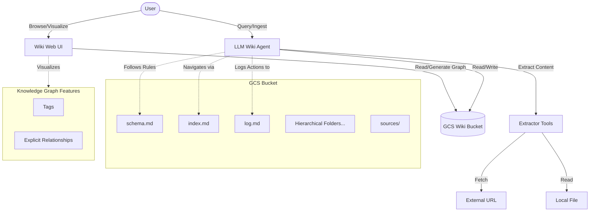
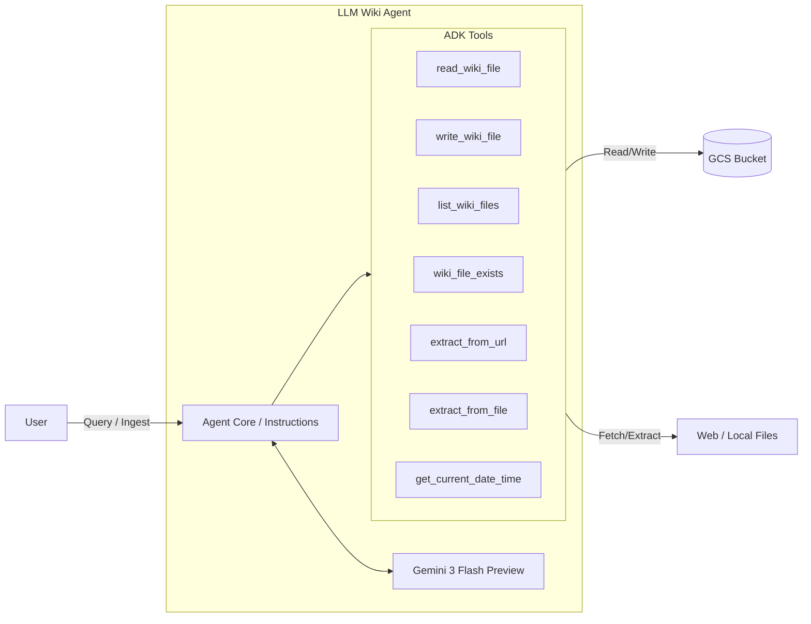

# Beyond RAG: The LLM Wiki Pattern for Compounding Agent Memory

## The Problem with Traditional RAG

Retrieval-Augmented Generation (RAG) has been the go-to pattern for grounding Large Language Models (LLMs) in specific data. While effective, traditional RAG has a fundamental limitation: **it is passive and stateless.**

When a query comes in, the system searches a vector database for relevant chunks, dumps them into the prompt, and the LLM synthesizes an answer from scratch. It doesn't remember what it learned last time. It doesn't connect dots across different queries. It doesn't build a compounding model of the world.

## The Solution: The LLM Wiki Pattern

This project demonstrates a different approach: the **LLM Wiki Pattern**. Instead of relying on a vector database for passive retrieval, the agent actively builds and maintains a structured, interlinked knowledge base (a Wiki) in Google Cloud Storage (GCS).

Key characteristics of this pattern:
1.  **Active Synthesis**: The agent doesn't just retrieve; it reads, summarizes, and integrates new information into existing pages or creates new ones.
2.  **Compounding Memory**: The wiki grows and becomes richer over time. The agent can cross-reference past findings.
3.  **Index-Guided Navigation**: The agent uses a central `index.md` file to navigate the wiki, avoiding the need for vector databases.
4.  **Knowledge Graph Integration**: The agent captures explicit relationships and tags, creating a true knowledge graph.
5.  **Dynamic Hierarchy**: Files are organized into a multi-layered directory structure that grows dynamically based on domain and topic.

## Technical Design

The system is built using the **Google Agent Development Kit (ADK)** and leverages the `gemini-3-flash-preview` model for its reasoning and acting capabilities.

### Architecture

The system consists of four main layers:
-   **Raw Sources**: Immutable files or URLs provided by the user.
-   **The Wiki**: A dynamic, multi-layered hierarchy of LLM-generated markdown files stored in a GCS bucket.
-   **The Schema**: A set of rules and conventions (`schema.md`) that the agent must follow.
-   **The Web UI**: A Next.js application providing a searchable interface, a tree-view navigation, and an interactive graph view.

### System Interaction Flow

Here is how the components interact:

### Agent Internal Architecture

While the diagram above shows the system-level interaction, the agent itself is a sophisticated component built with the Google ADK. Here is a look inside the agent:

### Key Workflows

-   **Ingestion**: When new content is provided, the agent extracts the text, creates a summary in the `sources/` directory, identifies key entities, concepts, and protocols (like MCP), and places them in a logically determined hierarchical directory. It also identifies explicit relationships and tags, updates the `index.md`, and logs the action.
-   **Querying**: To answer a question, the agent consults `index.md` to locate relevant pages, reads them, and synthesizes a response, citing the sources.

## Rich Visualization and Discovery

To make this compounding memory accessible to humans, the project includes a custom Web UI:

1.  **Tree-View Sidebar**: Dynamically generates a navigation tree supporting arbitrary depth, making it easy to explore the hierarchical structure.
2.  **Interactive Graph View**: Visualizes nodes (files and tags) and links (general links and explicit relationships).
    *   **Tag Clustering**: Files cluster around shared tag nodes, revealing common topics.
    *   **Relationship Highlighting**: Explicit relationships are rendered in distinct colors with directionality.
3.  **Perspective Rendering**: Clicking a node filters the graph to show only that node and its immediate neighbors, allowing you to focus on specific contexts.

## The LLM Wiki Pattern vs. Traditional RAG

To fully appreciate the benefits of this approach, let's compare it directly with traditional Retrieval-Augmented Generation (RAG).

### Traditional RAG: Passive and Stateless

In a standard RAG setup:
1.  **Ingestion**: Documents are chunked, embedded, and stored in a vector database. This is a largely automated, non-semantic process.
2.  **Retrieval**: A user query is embedded, and the system retrieves top-$K$ chunks based on vector similarity.
3.  **Generation**: The LLM reads the chunks and generates an answer.

**Limitations:**
*   **Lack of Synthesis**: The system never synthesizes the chunks into a coherent whole *before* query time.
*   **No Cross-Referencing**: It struggles to connect dots across different documents unless they happen to be retrieved together.
*   **Hallucination Risk**: Vector search can retrieve superficially similar but contextually irrelevant chunks, leading to hallucinated answers.

### The LLM Wiki Pattern: Active and Stateful

The LLM Wiki pattern flips this model by having the agent actively manage a structured knowledge base.

**Key Benefits Over RAG:**

1.  **Compounding Intelligence (Stateful Memory)**: Instead of answering every query from raw chunks, the agent reads new information and *integrates* it into existing knowledge. The wiki becomes smarter over time, just like a human brain or a well-maintained corporate wiki.
2.  **High-Fidelity Relationships**: By using explicit frontmatter relationships and tags, the system creates a high-precision Knowledge Graph. RAG relies on fuzzy semantic similarity; the Wiki pattern uses hard, semantic links created by the LLM itself.
3.  **Reduced Noise and High Precision**: Guided by a central `index.md` and strict schemas, the agent knows exactly where to find information. It doesn't get confused by similar-sounding but unrelated chunks of text.
4.  **Human Auditable and Editable**: Traditional RAG stores data in a complex, binary vector database that humans cannot read or easily fix. The LLM Wiki consists of plain markdown files in GCS. A human expert can read them, spot errors, and edit them directly to correct the agent's memory.
5.  **Zero Vector Infrastructure**: You don't need to manage a vector database, handle embedding models, or tune chunk sizes and overlap parameters. This significantly reduces infrastructure cost and complexity.

## Why This Is So Important

The LLM Wiki pattern represents a step towards more autonomous and capable AI agents.

-   **From Retrieval to Knowledge Management**: It shifts the paradigm from passive retrieval to active knowledge management. The agent is not just a search engine; it is a researcher and a librarian.
-   **Enabling Continuous Learning**: It provides a concrete mechanism for agents to accumulate knowledge over time, overcoming the context window limitations of individual sessions.
-   **Foundation for Complex Reasoning**: A structured, interlinked knowledge base is a much better foundation for complex, multi-step reasoning than a pile of disconnected document chunks.

This project shows that with the right scaffolding and tools, LLMs can be empowered to manage their own knowledge, leading to more intelligent and reliable behavior.
