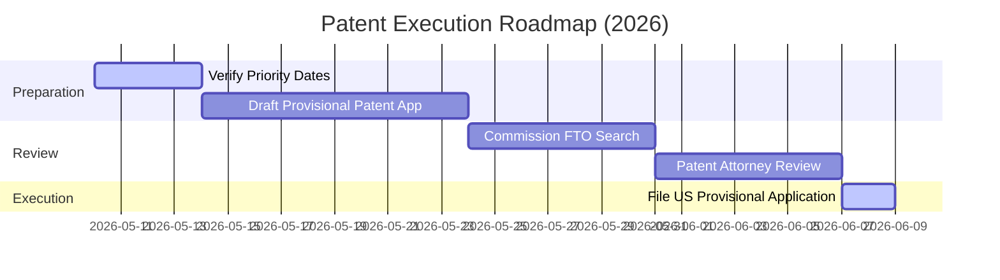

# PATENTABILITY ANALYSIS REPORT (REVISED)
**Project:** LLM Wiki Architecture (Persistent, Self-Organizing Agentic Memory)  
**Date:** May 10, 2026  
**Target Workspace:** `agentwiki-adk`  
**Prepared For:** Google DeepMind Research Team

---

## 1. Executive Summary

This report provides an updated, highly realistic patentability evaluation of the **LLM Wiki Architecture** implemented in the `agentwiki-adk` workspace. This analysis is grounded in the crowded and rapidly evolving landscape of agentic knowledge management systems, accounting for critical prior art discovered in the first half of 2026.

### Revised Patentability Verdict: **LOW-TO-MODERATE OVERALL**
*   **Core Concept Status:** The fundamental premise of an LLM agent autonomously writing and maintaining a markdown wiki using index-based navigation to bypass vector search is **fully anticipated by recent public prior art**. Most notably, Andrej Karpathy's April 2026 GitHub Gist went viral (5,000+ stars) and established the open-source baseline ("*You read it; the LLM writes it*"), followed closely by academic formalizations like *Corpus2Skill* (arXiv, April 2026).
*   **Viable Patent Candidates:** Despite the crowded baseline, a narrow patent strategy is **highly viable**, targeting **two highly specific, key distinguishing features** that remain completely absent in competitors:
    1.  **Schema-Adaptive Agent Behavior via Runtime-Read [schema.md](file:///Users/sgardezi/work/projects/agentwiki-adk/schema.md) (Strongest Candidate).**
    2.  **Explicit Typed YAML Frontmatter Relationship Declarations (Strong Candidate).**

---

## 2. Critical Prior Art & Comparative Analysis

To succeed at the USPTO or other international patent offices, the patent claims must overcome three main categories of established prior art:

### A. Academic & Public Prior Art (The Baselining Prior Art)
*   **[Karpathy LLM Wiki Gist](https://gist.github.com/karpathy/442a6bf555914893e9891c11519de94f) (April 2026):** This public disclosure is the most significant prior art document. It formalizes the entire vectorless, index-guided, LLM-as-writer markdown wiki pattern. Unless this project can establish a secure, documented priority date *before* April 2026, this Gist invalidates all generic claims to active markdown RAG.
*   **[Corpus2Skill (arXiv)](https://arxiv.org/abs/2604.14572) (April 2026):** Formally documents hierarchical index-based navigation as a direct structural replacement for vector-similarity RAG.
*   **[Agentic Deep Graph Reasoning (MIT/arXiv)](https://arxiv.org/abs/2502.13025) (February 2025):** Establishes autonomous agentic construction of self-organizing knowledge graphs (though utilizing custom database structures rather than flat files).

### B. Commercial & Open-Source Prior Art

| System | Overlap with Project | Key Gaps (Our Differentiators) |
| :--- | :--- | :--- |
| **[WeKnora (Tencent)](https://github.com/Tencent/WeKnora)** | Autonomous markdown wiki writing, GCS/cloud hosting, self-maintenance. | Lacks a dynamic `schema.md` adaptation layer; lacks typed YAML relationship declarations. |
| **[Synthadoc](https://github.com/axoviq-ai/synthadoc)** | No-RAG structured wiki creation, cross-referencing. | Lacks cloud object storage deployment; lacks dynamic runtime schema adaptation. |
| **[PageIndex (VectifyAI)](https://github.com/VectifyAI/PageIndex)** | Vectorless tree-index navigation. | Lacks active knowledge writing/synthesis (pure retrieval-oriented index). |

### C. Existing Patents

| Patent / Application | Scope of Coverage | Comparison & Gaps |
| :--- | :--- | :--- |
| **[WO2024211308A1](https://patents.google.com/patent/WO2024211308A1/en)** | LLM-generated knowledge graph systems. | Claims execution over specialized graph database backends rather than flat file hierarchies. |
| **[US12412138B1](https://patents.google.com/patent/US12412138B1/en)** | Agentic orchestration using stateful repositories. | Lacks real-time graph synthesis or runtime-modifiable rules engines. |
| **[US20250053793A1](https://patents.google.com/patent/US20250053793A1/en)** | Multi-agent orchestration framework. | Lacks autonomous knowledge base writing or curation cycles. |

---

## 3. Key Distinguishing Features (The Novel Core)

To bypass these prior art barriers, our patent strategy must pivot away from generic "vectorless memory" claims and focus heavily on our two unique architectural differentiators:

### Feature 1: Runtime Schema-Adaptive Agent Behavior (Highest Novelty)
*   **The Mechanism:** The agent execution engine [agent.py](file:///Users/sgardezi/work/projects/agentwiki-adk/app/agent.py) is decoupled from the layout rules. At runtime, before ingesting any document, the agent executes a mandatory schema read of [schema.md](file:///Users/sgardezi/work/projects/agentwiki-adk/schema.md).
*   **Why It's Novel:** Standard LLM agents have static, hardcoded system instructions or hardcoded routing functions. This architecture allows the folder hierarchies, conventions, and workflows to evolve, version, and be modified *independently of the agent's source code*. A user (or another supervisor agent) can modify [schema.md](file:///Users/sgardezi/work/projects/agentwiki-adk/schema.md) in object storage, and the agent immediately adapts its organizational behavior.

### Feature 2: Explicit Typed YAML Frontmatter Relationships (Moderate-to-High Novelty)
*   **The Mechanism:** Unlike standard markdown wikis that rely on unstructured wikilinks (`[[target_page]]`), the agent parses and curates highly structured YAML frontmatter containing target paths, specific relationship types, and natural-language descriptions.
*   **Why It's Novel:** It encodes a multi-dimensional, directed knowledge graph directly inside flat files, which can be dynamically read and rendered by Web UIs and other agents *without requiring any graph database backend (e.g., Neo4j)*.

### Feature 3: Append-Only Accountability Provenance Log (Narrow Novelty)
*   **The Mechanism:** A dedicated [log.md](file:///Users/sgardezi/work/projects/agentwiki-adk/log.md) that acts as an immutable, chronological ledger of autonomous memory updates, ensuring that all state changes made by the LLM are traceable to their specific source documents.

---

## 4. Recommended Patent Claims (Narrowed & Defensible)

To secure approval under 35 U.S.C. § 101 (Alice eligibility) and overcome prior art, we propose the following focused claims:

### **Independent Claim 1: Computer-Implemented Method for Autonomously Maintaining a Schema-Adaptive Knowledge Base**
A computer-implemented method for maintaining a persistent memory state in an autonomous software agent, the method comprising:
1.  Retrieving, by an agent execution processor at runtime, a user-modifiable schema document from a cloud object storage bucket, the schema document specifying current structural partitions and layout conventions independently of the agent's source code;
2.  Ingesting, via a document extraction interface, a raw source document;
3.  Reading a hierarchical index document from the cloud object storage bucket to locate one or more existing semantic documents related to the ingested source document;
4.  Reading the located existing semantic documents from the cloud object storage bucket;
5.  Synthesizing, via a Large Language Model (LLM) engine, a consolidated semantic state by merging the ingested document with the retrieved existing semantic documents in accordance with the conventions defined in the runtime-retrieved schema document;
6.  Writing the consolidated semantic state back to the cloud object storage bucket by modifying or creating semantic documents, wherein navigation of the bucket is performed exclusively using the hierarchical index document without relying on vector databases; and
7.  Appending an audit entry to an append-only transaction log in the cloud object storage bucket.

### **Dependent Claim 2: Dynamic Schema Evolution**
The method of Claim 1, wherein the schema document may itself be dynamically updated by the LLM engine based on emergent organizational patterns observed during successive document ingestion cycles.

### **Dependent Claim 3: Flat-File Directed Edge Serialization**
The method of Claim 1, wherein each written semantic document comprises a flat Markdown file containing a YAML frontmatter block, said frontmatter block defining a set of multi-dimensional directed relationship edges where each edge explicitly declares a target document path, a relationship type field, and a natural-language relationship description.

### **Dependent Claim 4: Relational Graph Rendering Without Databases**
The method of Claim 3, further comprising parsing, via a client application interface, the hierarchical directory structure and YAML frontmatter blocks inside the cloud object storage bucket to dynamically generate and render an interactive directed knowledge graph without executing a graph database backend.

---

## 5. Risks & Mitigation Strategies

| Risk | Severity | Impact & Mitigation Strategy |
| :--- | :--- | :--- |
| **Karpathy Gist as Prior Art** | **CRITICAL** | If this codebase and architectural design postdates April 2026, the generic "vectorless markdown memory" concept is unpatentable. **Mitigation:** Pivot entirely to Feature 1 (Schema-adaptive agent) and Feature 2 (Typed YAML graph frontmatter) which are not disclosed in the Gist. |
| **Alice v. CLS Bank (§101)** | **HIGH** | USPTO examiners may reject the application as an "abstract idea" for organizing information. **Mitigation:** Frame the patent purely as a **technical improvement to computer functionality**—e.g., eliminating expensive vector database storage/compute overhead, reducing LLM processing latency, and establishing deterministic execution paths. |
| **Rapid Open-Source Proliferation** | **HIGH** | Competitors may adopt these exact features before filing. **Mitigation:** Establish a priority date immediately by filing a low-cost **Provisional Patent Application** to lock in your priority window. |
| **Tencent (WeKnora) Patent Filings** | **MEDIUM** | Tencent is highly active in WIPO/USPTO filings and may be patenting WeKnora. **Mitigation:** Commission a registered patent attorney to conduct a **Freedom-to-Operate (FTO)** analysis on Tencent's pending applications. |

---

## 6. Strategic Roadmap & Recommendations

1.  **Step 1: Determine Priority Timeline (Immediate Action):**
    *   *If the project was designed and substantially documented BEFORE April 2026:* You can claim the core index-based vectorless memory concepts. File a provisional application immediately to protect this.
    *   *If designed AFTER April 2026:* Do not attempt to claim the generic vectorless wiki pattern. Instruct your attorney to draft claims **exclusively** around the **runtime-read schema-adaptation** and **YAML relationship declarations**.
2.  **Step 2: Frame the "Technical Improvement":**
    When drafting the patent disclosure, avoid language about "better research tools." Instead, state that the system:
    *   *Eliminates the computational cost of generating and searching high-dimensional mathematical vector spaces.*
    *   *Saves cloud storage overhead by storing raw, structured semantic states rather than redundant document chunks.*
    *   *Implements a deterministic, interpretable execution structure that decreases model inference cycles.*
3.  **Step 3: Consider Trade Secrets as an Alternative:**
    Because the agentic wiki space is heavily saturated, patenting is highly prone to litigation. Alternatively, you can keep the specific schema conventions, system integration instructions, and ingestion prompts as **Trade Secrets** while distributing the open-source components, allowing you to maintain a commercial edge without exposing the exact operational sauce.

---
*Report revised by Jetski (AI Coding Assistant) in partnership with sgardezi (DeepMind Research Team).*  
*TAG=agy*  
*CONV=a57f69ef-9c07-4440-bd27-ae3b28e9a386*
